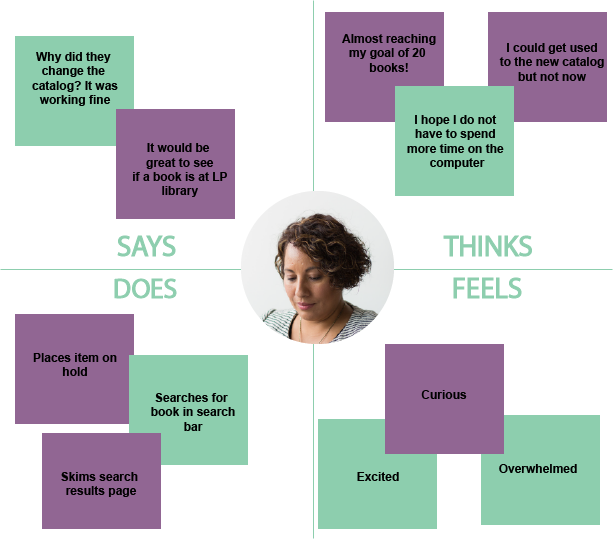

# Assignment 5

## 📖 The Purpose of UX Storytelling
UX storytelling is important for UX designers to conduct in order to better understand their users needs and expectations. Further, UX storytelling allows designers to step into the users' shoes and create a user-centered design. 

## 👤 Persona & Empathy Map

### Persona 1: Eva Arteaga

#### Eva's Empathy Map

### Persona 2: Christina Perez

#### Christina's Empathy Map

## 🗺 Scenarios & Journey Map

### 1. Eva's Scenario & Journey Map
#### Why Eva is using this product
> Eva is using the LA County Library's online cataloge to search, find, and check-out books for her children. With the temporary closures of all LA County Library branches, she and her family are no longer able to visit the library and look through the collection to find a new book to read. Instead, the library offers Side Walk Serive at their libraries. Patrons can place items on hold through their cataloge and pick up their items when they are ready. 

#### How Eva is using this product
> After work, Eva goes on the LA County Library website using her laptop. She calls over her kids so they could look through the catalog together. When they are on the home page, they have a difficult time finding the catalog. Not even the Teen & Kids tab had a catalog for the kids. They finally see a search bar drop down when clicking on "Show Search" in the middle of the header on the home page.

#### Eva's Journey Map

### 2. Christine's Scenario & Journey Map
#### Why Christine is using this product
> Christine is a "regalur" patron who often visits and uses the resources and LA County Library websites. Now that she using computers and her phone more often, she decided to try to finish 20 books by the end of the year to give her eyes a break from looking at a screen. Before the change to a new catalog, Eva would often use the library catalog to place items on hold. She continues to use the library cataloge to check out more books. She does not know why the LA County Library decided to change their catalog vendor and interface.

#### How Christine is using this product
> Before bed, Christine looks for a new title on the library catalog. She likes to use her computer to conduct searches online 

#### Christine's Journey Map

