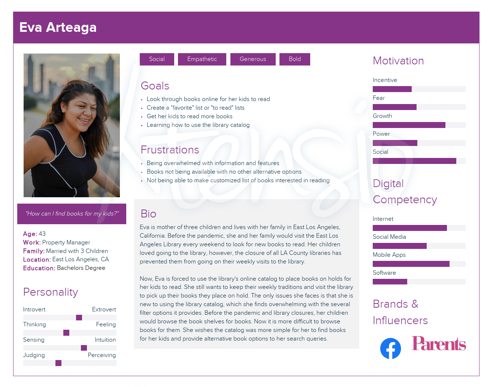

# Assignment 5

## 📖 The Purpose of UX Storytelling
* The purpose of UX storytelling is to shift your perspective to the user's perspective and see the world how they would see it.
* Creating personas and their story lets you and your team share the same image of the users.
* Storytelling also helps filter out any biases you or your interviewees had and focus solely on the users.

## 👤 Persona & Empathy Map

### Persona 1: Eva Arteaga

#### Eva's Empathy Map

### Persona 2: Christina Perez

#### Christina's Empathy Map

## 🗺 Scenarios & Journey Map

### 1. Eva's Scenario & Journey Map
#### Why Eva is using this product
> Mai currently volunteers at the Children’s Hospital Los Angeles while she takes a gap year before applying to medical school. She wants to become a pediatrician, so being able to connect to children and their parents is something she really values. Recently, a 12-year old patient she helps take care of asked Mai what books she recommends. Thus, Mai decided to explore children and young adult books she can recommend to patients. She wants to log books in a creative, journal-like way with colors and maybe even drawings, so her patients would also feel encouraged to log books and share them. However, she wants to be able to digitize her logs so more people can have access to them.

#### How Eva is using this product
> During her lunch break, Mai turns her phone on to log a book: Charlotte’s Web. When she opens the application, there is a button to “log book” in the menu, so she presses that. A new window pops up and she fills in the empty spaces that say “What’s the title?” “Who’s the author?” “What’s the genre?” “What did you think of this book?”... and so on. After typing those sections, Mai looks at the book log journal-entry, and decides to add some color. She clicks the edit button, and clicks the option to highlight certain sections and change the color and font of the words. Feeling satisfied, she presses the “publish” button, where she can share it through various social media and even print it as a pdf. 

#### Eva's Journey Map

### 2. Christine's Scenario & Journey Map
#### Why Christine is using this product
> Nicole just moved to Irvine from New York after getting married. She really misses her four best friends from back in New York. They used to have a book club where every month, they read one book and meet at her apartment to talk about it over dinner. Nicole and her friends still want to have an “online book club,” where they can discuss books and recommend new books to each other. She also wants to be able to track and organize all of the books she’s read by herself and with her friends.

#### How Christine is using this product
> After dinner, Nicole opens the app to see that her friend Lisa posted a comment about a book she and her friends are reading together. She responds to the comment by clicking the “reply” button under Lisa’s comment. Nicole also found a new book she wants to read with them, so she types in the title of the book in the search bar, then clicks “share,” and shares them to her friends.

#### Christine's Journey Map

