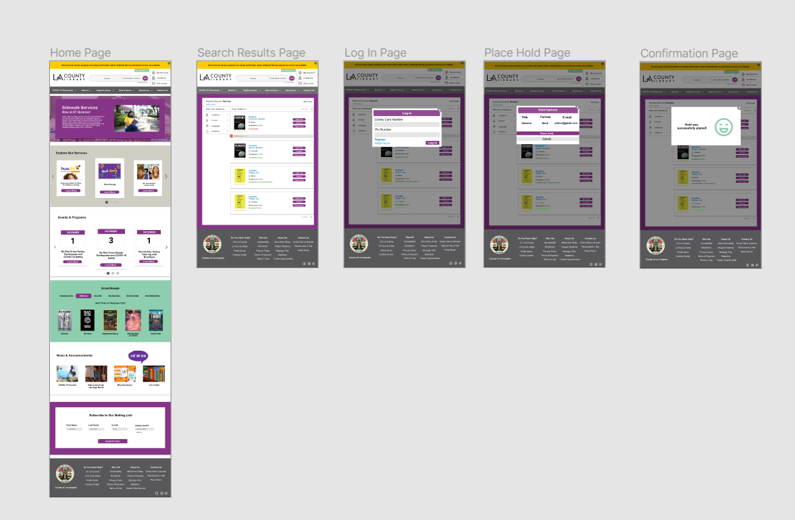

# High-Fidelity-Prototype - LA County Library Website
Anita Morales

DH 250: User Expereience Design

### Project Description ###
**Purpose:** The purpose of this prototype is to provide visual solutions I reccomend the LA County Library to implement for their current website. This high fidelity prototype is an outcome of solutions discovered from user testing and customer journey mapping for both my personas.

**Process:** This high fidelity, interactive protoype was initiated when discovering the moderate challenges the LA County Library website contains for its users( i.e; overwhelming catalog options). After conducting user tests, interviews, and creating customer journey maps for my personas, I created low fidenlity wireframes that addressed the concerns and needs of each user. This protype was created using Figma.

# Tasks #
:heavy_check_mark:**: Locating and searching for an item on the online catalog**

:heavy_check_mark:**: Seeing if a book is available at the nearest library location**

:heavy_check_mark:**:Placing a book on hold**

### High Fidelity Wireframes ###
**Iteration 1**

<iframe style="border: 1px solid rgba(0, 0, 0, 0.1);" width="800" height="450" src="https://www.figma.com/embed?embed_host=share&url=https%3A%2F%2Fwww.figma.com%2Ffile%2F6R3jDsG5hcAloUtvGgtAc2%2FLA-County-Library%3Fnode-id%3D0%253A1" allowfullscreen></iframe>

