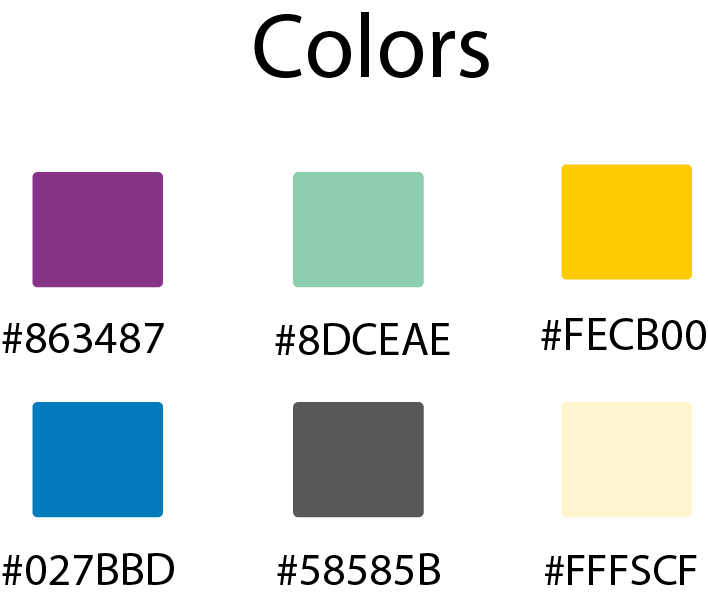
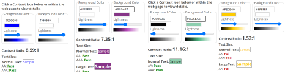

# High-Fidelity-Prototype - LA County Library Website
Anita Morales

DH 250: User Expereience Design

### Project Description ###
**Purpose:** The purpose of this prototype is to provide visual solutions I reccomend the LA County Library to implement for their current website. This high fidelity prototype is an outcome of solutions discovered from user testing and customer journey mapping for both my personas.

**Process:** This high fidelity, interactive protoype was initiated when discovering the moderate challenges the LA County Library website contains for its users( i.e; overwhelming catalog options). After conducting user tests, interviews, and creating customer journey maps for my personas, I created low fidenlity wireframes that addressed the concerns and needs of each user. This protype was created using Figma.

# Tasks #
:heavy_check_mark:**Locating and searching for an item on the online catalog**

:heavy_check_mark:**Seeing if a book is available at the nearest library location**

:heavy_check_mark:**Placing a book on hold**

## Prototype Design ##
**Colors**

Since the LA County Library just re-branded, I decided to re-use their color theme. I used a Google Chrome extension called "ColorZilla" to find the hex codes for each color on their website. Their main color palette that I used includes the purple (#863487), green (#8DCEAE), and yellow (#FECB00). Each of these colors are also found in their logo.

**Typography**
Utilizing WhatFont, a Google Chrome extension that provides font information on a webpage, I found that the LA County Library uses Viva Beautiful Pro font for their headers. For other texts, Gibson was used. Unfortanelty, I was not able to access Viva Beautiful Pro nor Gibson with Figma. Instead, I used Arial Rounded MT for the typography found on the prototype designs. 

## Iteration 1 ##

### Impression Test ### 
I went ahead and interviewed three of my classmates for the Impression Test. They shared that overall, the design was impressive, but shared the following designs were confusing:
        - Search bar: Was not automatically apparent that the design was a search bar.
        - Buttons: Change the color of the "log in" and "Place Hold" buttons 
        - Incomplete home page: Would like to see the entire webpage 

### Cognitive Walthrough ###
For the cognitive walkthrough, I interviewed three of my collegues. They shared that the prototype was clear and straightforward for users to successfully use the library catalog and place a hold.

**Iteration 2**

### Wireflow ###

## Accessibility ##
Due to Figma plug-ins on accessibility providing varying outcomes on accessibility tests, I went forth and used Wave to examine color contrast. Overall, the design is accessible, with the excpetion of the yellow notification bar on the top of each page. Since the yellow bar is a drop down box that users can close, I will still need to return to the design and change its colors. 

## Reflection ##
