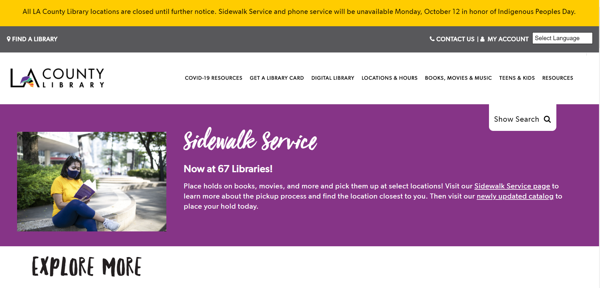

# Creating an Accessible Website for a Library 
## Assignment 1: Heuristic Evaluation
### Anita Morales | DH-150 | Fall 2020

Project Description:

Designing a new and accessible website for libraries in the midst of a pandemic is significant in continuing to help patrons. Many are sheltering at home and institutions, such as libraries, remain closed to the public and;therefore, are forced to redesign their services. With services going online, the digital divide is apparent. It makes it more difficult when a library's websites are difficult to navigate and overwhelming to use. Focusing on the two major library systems in Los Angeles, I will be evaulating both Los Angeles Public Library and LA County Library's website in order to design a more simple and easy to use website for middle-age patron who indentify as female.

### Severity Ratings in Heuristic Evaluation - [Nielson Norman Group](https://www.nngroup.com/articles/how-to-rate-the-severity-of-usability-problems/)  
Rating  | Importance  |
:---: | :---  |
1  | Cosmetic problem only: need not be fixed unless extra time is available on project  |
2  | Minor usability problem: fixing this should be given low priority  |
3  | Major usability problem: important to fix, so should be given high priority  |

## Website 1: [LA County Library](https://lacountylibrary.org/)

The LA County Library is one of the largest library systems in the United States. It contains a total of 86 library branches that are spread throughout Los Angeles County and it serves about 3.4 million residents. Their website is full of resources, services, and information that is targeted for all ages and backgrounds.

Why I selected this website:

Since their re-branding in 2017, LA County Library redesigned and reformatted their library. They also transitioned in to using a new catalog and user system. It was interesting to evaluate these changes and if they improved the experience for users.

 
 

### Evaluation

Heuristic & Description |  Severity Rating | Improvement 
--------------------------|---------------------------|------------
**Visibility of system status:** The web/app gives the user feedback in a timely manner concerning the actions they are currently doing. | **2:** When user signs up for the newletter throught the forum, they get redirected to the homepage. The user has to scroll down to confirm if their information was correctly submitted and collected | **Improvement:** Provide the user with an explicit confirmation message (either through a pop-up or re-direct them to a confirmation page) about successfully joining the newsletter.
**Match between system and real world:** Design and icons are based off of general knowledge. Things the user will easily recognize. | **1:** When the user signs in and views the items check out to their account, the page is designed similar to a shopping cart on an online store. The two arrows in a gray circle found under each heading (Title, Times Renewed, and Date due) cause confusing. It gives off the message that the users list of items would be shifted up or down; however, the order gets re-organized in alphabetical order or chronology. | **Improvement:** Re-design the arrows in a circle to hyperlinked words such as "alaphabetical order" or "chronological order".
**User control and freedom:** User has options to undo or redo actions. | **3:** When user is looking at their account and wants to return to the homepage, they are directed to a new window. They do not have the flexibility to remaining logged in and navigating back and forth on the same window. | **Improvement:** Allow the user to remain logged in and confirm they are logged in by displaying their name on the top of the webpage where it reads "my account".
**Consistency and standards:** Design and usage is consistent across all pages of the web/app. | **3:** The design of main menu to the homepage differs from the menu found when the user is looking at their account. The homepage has a drop down menu with different second level menu headings, while the menu on the account page has differing menue headings and no drop down. The also differ in style of text. | **Improvement:** Have a unifrom menu and menu desing throughout each page on the website.
**Error prevention:** Provide safety nets for user, such as confirming an action. | **1:** The user is asked to confirm whether they intend to continue to suspend or cancel their holds. They are notified through a pop-up which also has a an "x" to undo their actions. | **No Improvements:** The site provides error prevention through pop-up confirmations. 
**Recognition rather than recall:** Provide suggestions or context in actions. | **1:** Interface includes familiar web features such as scroll bar. | **No Improvement:** The web interface and features are easy to use and are similar to other website structures.
**Flexibility and efficiency of use:** Make a page that is accessible to all, have basic functions at the forefront and more advanced options accessible through more steps. |**3:** The website's catalog contains an overwhelming amount of options to filter their search. The structure is targeted to librarians rather than the general public. | **Improvement:** Decrease the amount of filters or provide suggestions on how to use the catalog. 
**Aesthetic and minimalist design:** Design is not cluttered and easily accessible. | **1:** The large colored bars for each class at the home page are not needed. They clutter the page and make it so you have to scroll more. | **Improvement:** Take away the colored blocks and just have separate, distinct boxes for each course.
**Help users recognize, diagnose, and recover from errors:** Have a non-concerning message about an error and give information on how to fix it of move forward. | **1:** Error notification appears when user cannot change location of book currently available to be picked up. It shares reason why and to contact library for further assistance. | **No Improvement:** Provides user with reason on error and what to do next.
**Help and documentation:** Have easily accessible and understandable help pages or pages with commonly asked questions. | **3:** There is only an FAQ for Side Walk Services, downloading e-books, and an FAQ for library card holders. The website does not contain an FAQ for navigating the site or how to use the cataloge/ place items on hold. | **Improvement:** Have an FAQ for placing items on hold and using the catalogue. Also make the how- to  guides for online resources more accessible. 
