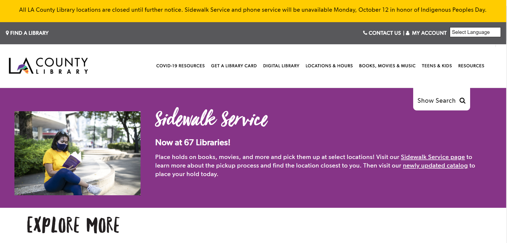

# Creating an Accessible Library Website
## Assignment 1: Heuristic Evaluation
### Anita Morales | DH-150 | Fall 2020

Project Description:

Designing a new and accessible website for libraries in the midst of a pandemic is significant in continuing to help patrons. Many are sheltering at home and institutions, such as libraries, remain closed to the public and;therefore, are forced to redesign their services. With services going online, the digital divide is apparent. It makes it more difficult when a library's websites are difficult to navigate and overwhelming to use. Focusing on the two major library systems in Los Angeles, I will be evaulating both Los Angeles Public Library and LA County Library's website in order to design a more simple and easy to use website for middle-age patron who indentify as female.

### Severity Ratings in Heuristic Evaluation - [Nielson Norman Group](https://www.nngroup.com/articles/how-to-rate-the-severity-of-usability-problems/)  
Rating  | Importance  |
:---: | :---  |
1  | Cosmetic problem only: need not be fixed unless extra time is available on project  |
2  | Minor usability problem: fixing this should be given low priority  |
3  | Major usability problem: important to fix, so should be given high priority  |

## Website 1: [LA County Library](https://lacountylibrary.org/)

The LA County Library is one of the largest library systems in the United States. It contains a total of 86 library branches that are spread throughout Los Angeles County and it serves about 3.4 million residents. Their website is full of resources, services, and information that is targeted for all ages and backgrounds.

 

